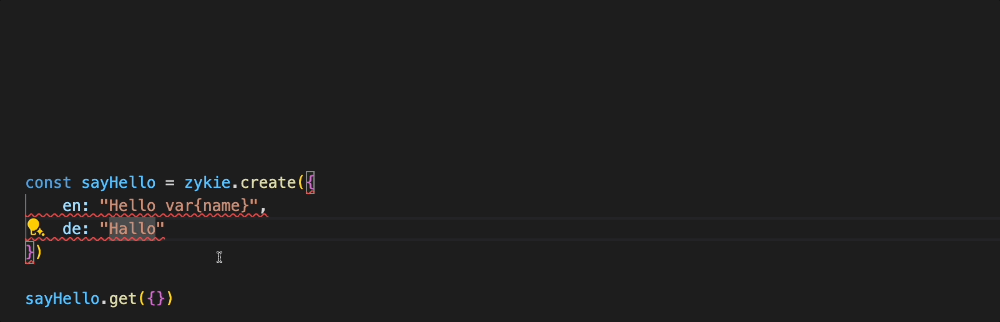

[](https://bundlephobia.com/result?p=zykie)
[](https://www.npmjs.com/package/zykie)

## Intro

Zykie allows you to easily build & consume fully typesafe translations in your app. It's a small, fast and scalable internationalization library with high focus on the type safety and developer experience.

### Features

- ✅&nbsp; Well-tested and production ready.
- 🧙‍♂️&nbsp; Full static typesafety & autocompletion
- 🐎&nbsp; Snappy DX - No code generation, run-time bloat, or build pipeline.
- 🍃&nbsp; Light - zykie has zero deps and a tiny client-side footprint.
- 🐻&nbsp; Easy to add to your existing brownfield project.

You can try a live demo [here](https://githubbox.com/zykie-enes-p5djdm/githubbox).

```bash
npm install zykie # or yarn add zykie or pnpm add zykie
```
## First create an instance

```ts
import { Zykie } from 'zykie'

const locales = ["en", "ba"] as const;
const currentLocale = "en";
const fallbackLocale = "en";

const zykie = new Zykie({
    locales,
    currentLocale,
    fallbackLocale,
});
```

## Then create a translation

```ts
const hello = zykie.create({
    en: "Hello",
    ba: "Zdravo",
});

console.log(hello.get({})); // Hello
```
## Variables
If you want to use variables in your translations, you can use the `var{variable}` syntax.

```ts
const greet = zykie.create({
    en: "Hello, var{name}",
    ba: "Zdravo, var{name}",
});

console.log(greet.get({ name: "John" })); // Hello, John
````
## Dynamic locales
You can also use change the current locale dynamically.

```ts
const locales = ["en", "ba"] as const;
const currentLocale = "en";
const fallbackLocale = "en";

const zykie = new Zykie({
    locales,
    currentLocale,
    fallbackLocale,
});

const greet = zykie.create({
    en: "Hello, var{name}",
    ba: "Zdravo, var{name}",
});

console.log(greet.get({name: "John"})); // Hello, John

zykie.changeLocale("ba");

console.log(greet.get({name: "John"})); // Zdravo, John
```
Locales can also be passed as an option to the `get` method. This is useful for cases where you want to use a different locale for a specific translation, but don't want to change the current locale.


```ts
console.log(greet.get({name: "John"}, {
    locale: "ba"
})); // Zdravo, John
```

## Variations
Zykie supports variations, which are useful for pluralization. To use variations, you can use the `variation` method.
Variations are evaluated in the order they are defined, and the first one that matches the condition is used.

```ts
const dollarAmount = zykie
    .create({
        en: "Hello, var{name} You have var{amount} dollars",
        ba: "Zdravo, var{name} imate var{amount} dolara"
    })
    .variation(({ amount }) => parseInt(amount) === 1, {
        en: "Hello, var{name} You have var{amount} dollar",
        ba: "Zdravo, var{name} Imate var{amount} dolar",
    })
    .variation(
        ({ amount }) => {
            const number = parseInt(amount);
            return number > 20 && number % 10 === 1;
        },
        { ba: "Zdravo, var{name} imate var{amount} dolar" }
    );

console.log(dollarAmount.get({ name: "John", amount: "1" })); // Hello, John You have 1 dollar
```


